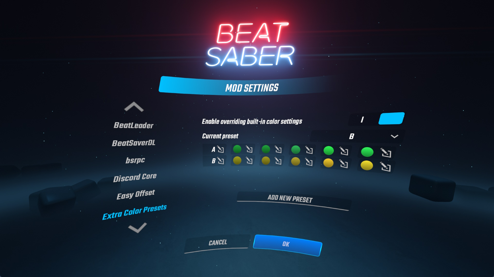

# Extra Color Presets for Beat Saber

Tired of being limited in the number of color override slots you can have in the base game?

This mod allows you to have virtually infinite color presets that you can create and swap between using the in-game settings UI.

## Installation

Download the [latest release](https://github.com/DJDavid98/BSExtraColorPresets/releases/latest) and extract it in the game install folder.

### Dependencies

These can be installed from ModAssistant, and they are required for the mod to work. 

- [BSIPA ^4.3.2](https://github.com/bsmg/BeatSaber-IPA-Reloaded)
- [BeatSaberMarkupLanguage ^1.8.1](https://github.com/monkeymanboy/BeatSaberMarkupLanguage)

## Configuration

1. Open the game settings from the main menu
2. Go to Mod Settings
3. Find the "Extra Color Presets" in the list on the left
4. Enable the mod
5. Add some presets, change the colors (Note: the list is scrollable even past 4 items, the UI buttons are missing for it right now but with proper controller bindings it can be scrolled)
6. Select the preset you want to use from the dropdown
7. Press save

### Future improvements

These features are planned in the future, do not make issues requesting them:

* The UI is a bit janky right now, but I expect to make some improvements in the future once I figure out how BSML works
* Add an option to delete individual presets (currently only possible via direct config editing)

## Screenshots

## Credits

Thanks to the Beat Saber Modding Group Discord members below for the pointers, ideas and suggestions:

* [@Futuremappermydud](https://github.com/Futuremappermydud)
* [@kodenamekrak](https://github.com/kodenamekrak)
* [@Kylemc1413](https://github.com/Kylemc1413)
* [@MillzyDev](https://github.com/MillzyDev)
* Riley / Nuggo

Based on existing mods:

* https://github.com/Caeden117/CountersPlus
* https://github.com/FizzyApple12/DiscordCore
* https://github.com/Kylemc1413/BeatSaber-CustomColors
* https://github.com/Kylemc1413/SongCore
* https://github.com/Meivyn/ExtendedColorSchemes
* https://github.com/ReadieFur/BSDataPuller
