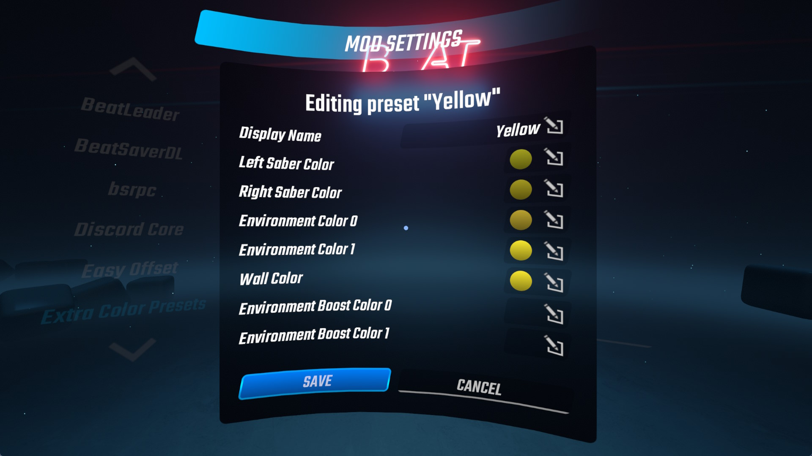

# Extra Color Presets for Beat Saber

Tired of being limited in the number of color override slots you can have in the base game?

This mod allows you to have virtually infinite color presets that you can create and swap between using the in-game settings UI.

## Installation

Download the [latest release](https://github.com/DJDavid98/BSExtraColorPresets/releases/latest) and extract it in the game install folder.

### Dependencies

These can be installed from ModAssistant, and they are required for the mod to work. 

- [BSIPA](https://github.com/bsmg/BeatSaber-IPA-Reloaded)
- [BeatSaberMarkupLanguage](https://github.com/monkeymanboy/BeatSaberMarkupLanguage)

## Configuration

1. Open the game settings from the main menu
2. Go to Mod Settings
3. Find the "Extra Color Presets" in the list on the left
4. Edit the existing default preset, or add additional ones with the "Add New Preset" button
5. Click OK to return to the Main Menu and either play solo or join a multiplayer lobby
6. On the left side, select the "MODS" tab and then "EXTRA COLOR PRESETS" 
7. Enable the overriding and select the preset you want to use from the dropdown (or leave it on Random for a random selection from all your presets)

### Future improvements

These features are planned in the future, do not make issues requesting them:

* The UI is a bit janky right now, but I expect to make some improvements in the future once I figure out how BSML works
* Add an option to delete individual presets (currently only possible via direct config editing)

## Screenshots

    

## Credits

Thanks to [@TheBlackParrot](https://github.com/TheBlackParrot) for inspiring the creation of this mod, and for the "Shuffle" preset implementation. Additionally, thanks to the Beat Saber Modding Group Discord members below for the pointers, ideas and suggestions:

* [@Caeden117](https://github.com/Caeden117)
* [@Futuremappermydud](https://github.com/Futuremappermydud)
* [@kodenamekrak](https://github.com/kodenamekrak)
* [@Kylemc1413](https://github.com/Kylemc1413)
* [@MillzyDev](https://github.com/MillzyDev)
* Riley / Nuggo
* [@RedBrumbler](https://github.com/RedBrumbler)

Based on existing mods:

* https://github.com/Caeden117/CountersPlus (BSML syntax)
* https://github.com/FizzyApple12/DiscordCore (BSML syntax)
* https://github.com/Kylemc1413/BeatSaber-CustomColors (prior art)
* https://github.com/Kylemc1413/SongCore (color replacement injection point)
* https://github.com/Meivyn/ExtendedColorSchemes (prior art)
* https://github.com/ReadieFur/BSDataPuller (Harmony patching approach)
* https://github.com/zeph-yr/JDFixer (how to put the UI in the song select screen)
